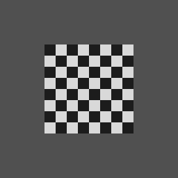
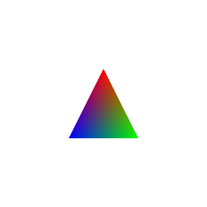
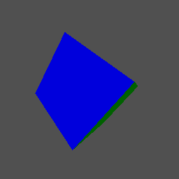

# MiniDriver

A **software rasterizer** — a miniature GPU render pipeline written from scratch in C++, with **no graphics API**. Every stage that a real GPU runs in hardware is implemented by hand, in order to understand how real-time rendering actually works *underneath* OpenGL and Vulkan.

## Why I built it

I wanted to *understand* the render pipeline, not just call OpenGL functions and hope for the best. So instead of starting from an API, I built the pipeline itself: a program that takes 3D vertices and turns them into pixels, one stage at a time. [GLM](https://github.com/g-truc/glm) is used for vector/matrix math only — everything else (rasterization, interpolation, depth, lighting, texturing, shading) is written by hand.

The goal was the foundation before the tooling: once you've built each stage yourself, an API like OpenGL stops being a black box and starts looking like *the same pipeline, running on hardware*.

## The pipeline, stage by stage

Each stage mirrors what a GPU does:

| Stage | How it's implemented |
|---|---|
| Vertex input | plain vertex + face data |
| Vertex transform | Model · View · Projection (GLM matrices) → clip space |
| Perspective divide + viewport | divide by `w`, map NDC → pixels |
| Rasterization | edge functions + barycentric coverage test |
| Attribute interpolation | **perspective-correct** (interpolate `u/w` and `1/w`, then divide) |
| Depth test | per-pixel **z-buffer** |
| Fragment shader | a `std::function` invoked per pixel (samples texture, applies light) |
| Framebuffer | color buffer → PPM image → GIF |

## Features

- **Triangle rasterization** with edge functions and barycentric coordinates.
- **Z-buffer** depth testing — correct occlusion, independent of draw order.
- **Perspective-correct texture mapping** — UVs stay glued to the surface, with no warping on tilted faces.
- **Diffuse (Lambert) lighting** — per-face normals dotted with a light direction.
- **Programmable fragment-shader stage** — the rasterizer stays generic and shading logic is a lambda passed in, exactly like a GPU fragment shader.
- **Animation** — renders a rotating model frame-by-frame and stitches the frames into a GIF.

## Gallery

| Barycentric color interpolation | Diffuse lighting |
| :---: | :---: |
|  |  |

## Tech

- **C++20**, **GLM** (math only)
- Visual Studio / MSBuild (`MiniDriver.sln`), x64
- Output: `Output/Frames/*.ppm` → GIF via `make_gif.py` (Pillow)

## Build & run

Open `MiniDriver.sln` in Visual Studio, build **Debug | x64**, and run. Frames are written to `MiniDriver/Output/Frames/`; from the `MiniDriver/` folder, run `py make_gif.py` to stitch them into an animated GIF.
